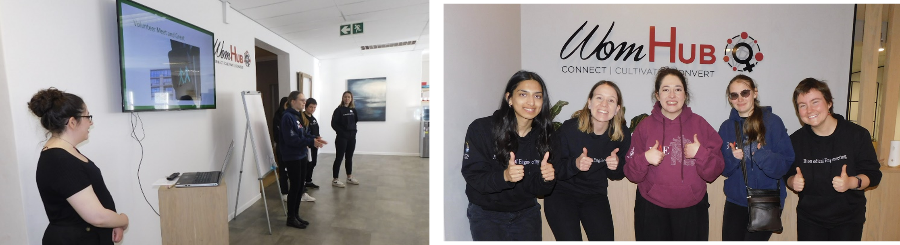
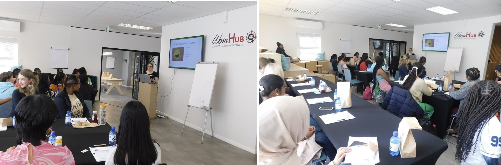
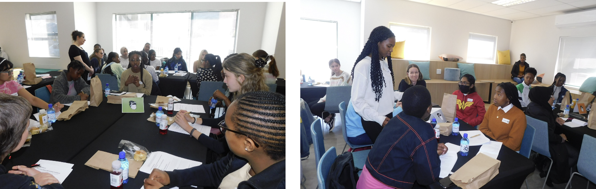
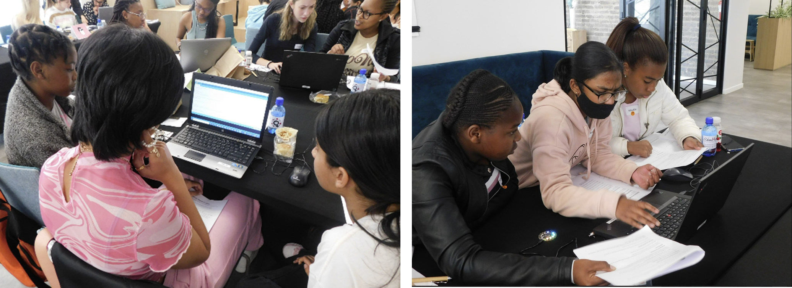

The day kicked off with the arrival of my dedicated team of volunteers ([Sansha Gupta](https://www.linkedin.com/in/sansha-gupta-b94810184/), [Victoria Bench](https://www.linkedin.com/in/victoria-bench-258b1baa/), [Alice Drozdov](https://www.linkedin.com/in/alice-drozdov-005552180/) and [Sharon Evans](https://www.linkedin.com/in/sharon-evans-6b0ab1187/)) to assist in the setup for the day. Their role throughout the day was to assist in the running of the discussion groups, answer the participants' questions, provide flash mentorship within the program, and provide technical support during the coding activity. 

My primary role throughout the day was the delivery of the [workshop content](/uploads/WomEng/slides.pdf). This took the form of a 4-hour-long presentation divided into different sections such as discussing what an engineer is, what a biomedical engineer does, and what makes for a good engineer. Embedded within my presentation delivery was the facilitation of discussion groups. 

The [discussion groups](/uploads/WomEng/VolunteerPack.pdf) took the form of brainstorming possible problems within the biomedical space that the girls may have encountered in their lived experience or may have an interest in solving. 

The highlight of the event, however, was the [coding activity](https://github.com/TaliWeinstein/biomedUnpackedWorkshop). This activity required the girls to learn how to use the Adafruit Circuit Playground Classic MCU Development Board 3000 and the Arduino IDE to read their photoplethysmography signal. 