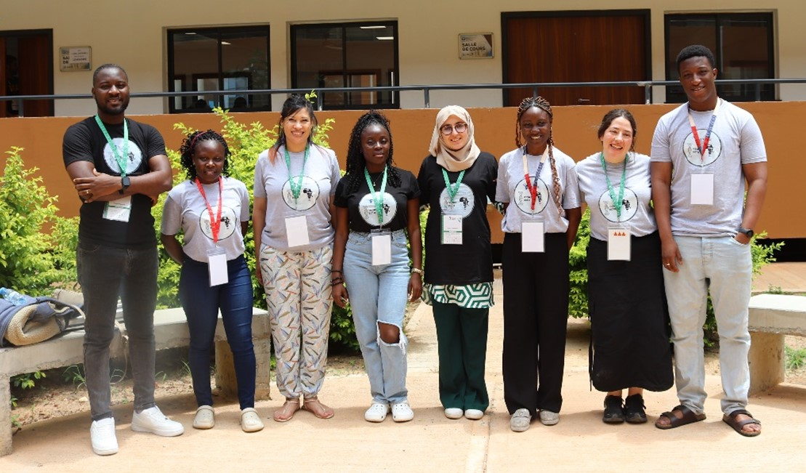

# Overview

The workshop was organised with the intention of having casual exchnages of knowledge from external mentors as well as self-directed interaction acitvities to facilitate collaboration in future. 

For the external mentors, we invited [Dr Mercy Asiedu](https://www.linkedin.com/in/mercy-n-asiedu/) and [MohammedElfatih MohamedKhair](https://www.linkedin.com/in/mohammedelfatih-mohamedkhair-0b29b4169/) from Google to present on the cutting edge AI techniques being applied in health care and disaster response respectively. This was followed up with an insightful tutorial [Gabriel Kallah-Dagadu](https://scholar.google.com/citations?user=tjlP04EAAAAJ&hl=en) to introduce participants to AI applied to healthcare data. 

We then moved onto the interactive portion of the day which consisted of a Design Dash, whereby participants were tasked with brainstorming an AI solution to a current problem facing African healthcare systems. This activity was well recieved by participants with many noting how the dynamics of idea formation and subsequent presentation helped with future collaboration options. We then moved onto the lightning talk section, whereby 5 participnat finalists were given 5 minutes to present their research to the workshop audience. This was judged by [Natasha Latysheva](https://www.linkedin.com/in/nslatysheva/) and myself. This was follwed with the finalists (chosen earlier in the week) of the ideathon presenting their solutions and the winner being announced. 

The day concluded with an ethics panel with panelists [Sibusisiwe Makhanya](https://www.linkedin.com/in/sibusisiwe-khuluse-makhanya/), senior research manager at IBM, [Mwigereri Dorcas](https://www.linkedin.com/in/mwigereri-dorcas-497b51b4/), AI in Health PhD researcher at Aga Khan University in Kenya, and [Dr Sekou Remy](https://www.linkedin.com/in/sekoulremy/), Seniour Research Scientist at IBM. The discussion ranged from the caution needed when deploying a model in a different location to where it was built, evaluating the need for the model at the problem level and the intracacies of applying for ethics when collecting or using secondary health data. 

The workshop was enjoyed by the participants with the feedback forms reflecting that that attendees appreciated the mix of sessions and activites on offer. A big thank you to the in-person team of volunteers who made the workshop success a possibility! For a full list of organisers, see the website. 

From left in picture above: 
[Dr Francis Agamah](https://www.linkedin.com/in/francis-agamah-3a5762115/), [Daphne Machangara](https://www.linkedin.com/in/daphne-machangara-a5688a112/), [Rolanda Julius](https://www.linkedin.com/in/rolanda-julius-388a1b214/), [Comfort Adesina](https://www.linkedin.com/in/comfort-adesina-77808b233/), [Imane Hamzaoui ](https://www.linkedin.com/in/imane-hamzaoui-667514199/), [Chinonyelum Igwe](https://www.linkedin.com/in/chinonyelum-igwe/), author and [Gbetondji Donovan](https://www.linkedin.com/in/gbetondji-dovonon/). Not picture [Ditiro Rampate](https://www.linkedin.com/in/ditiro-rampate-46a999a4/)

# Roles and Responsibilities
1. I played a key leadership role in organizing the workshop, defining subgroup tasks, actively engaging in meetings, and creating feedback forms to support future improvements. 
2. I was responsible for helping to secure speakers, organizing the AI in Healthcare Ethics panel, and sourcing prizes. In the lead-up to the event, I managed on-ground logistics, and handled challenges like speaker cancellations and a last-minute venue change. 
3. I facilitated the ethics panel and stepped in as a judge for the Lightning Talks. 
4. After the event, I managed the accounting, fund distribution to prize winners, and compiled a detailed feedback report. 

### Skills: 
Technical Communication, Event Planning, Ethics Panel Moderator, Fundraising, Lightning Talk Judge, STEM Education, Team Coordination, Workshop Creation