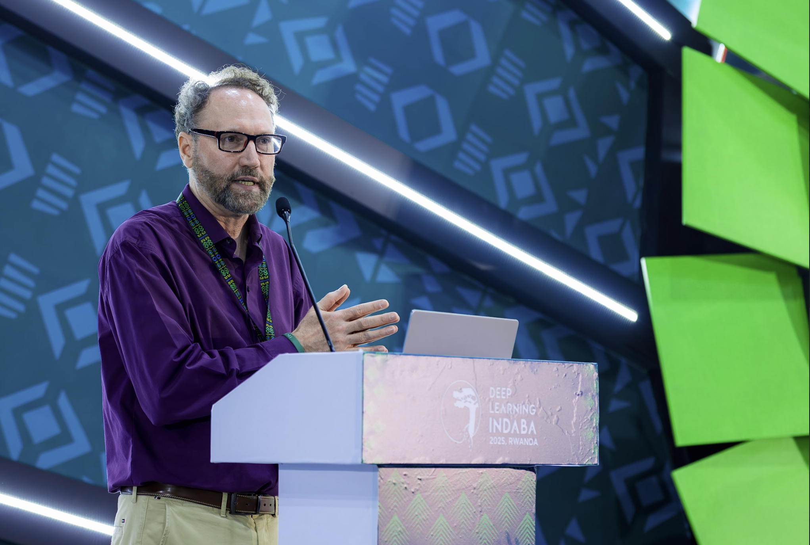
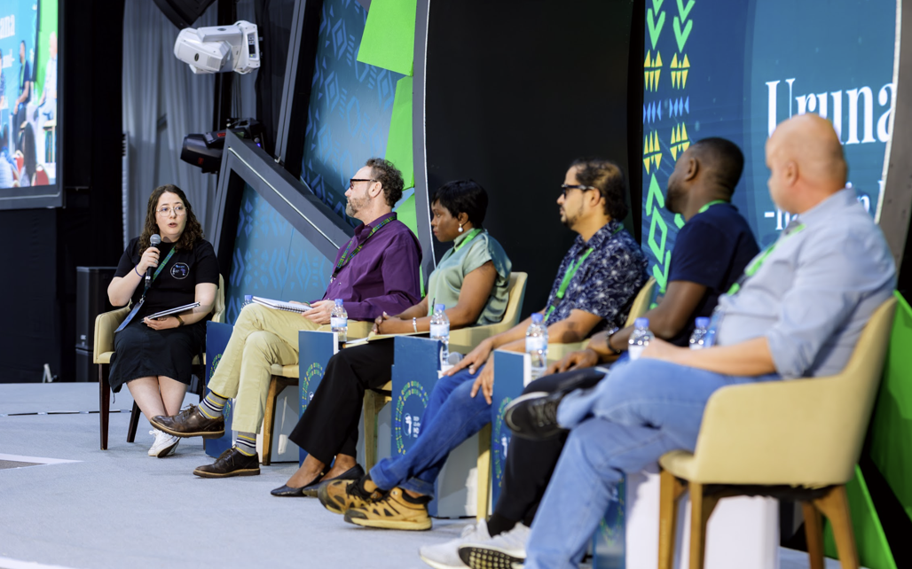
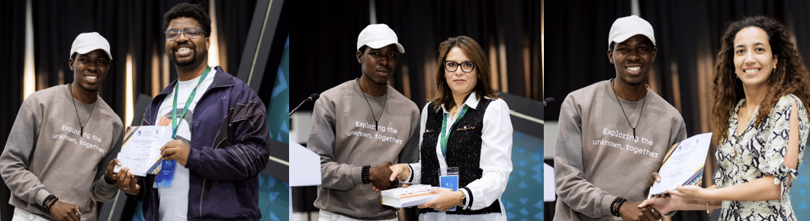
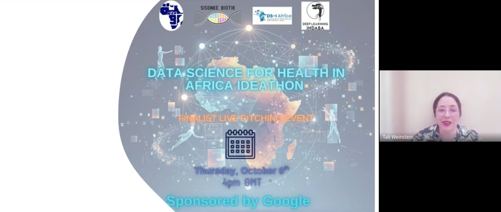
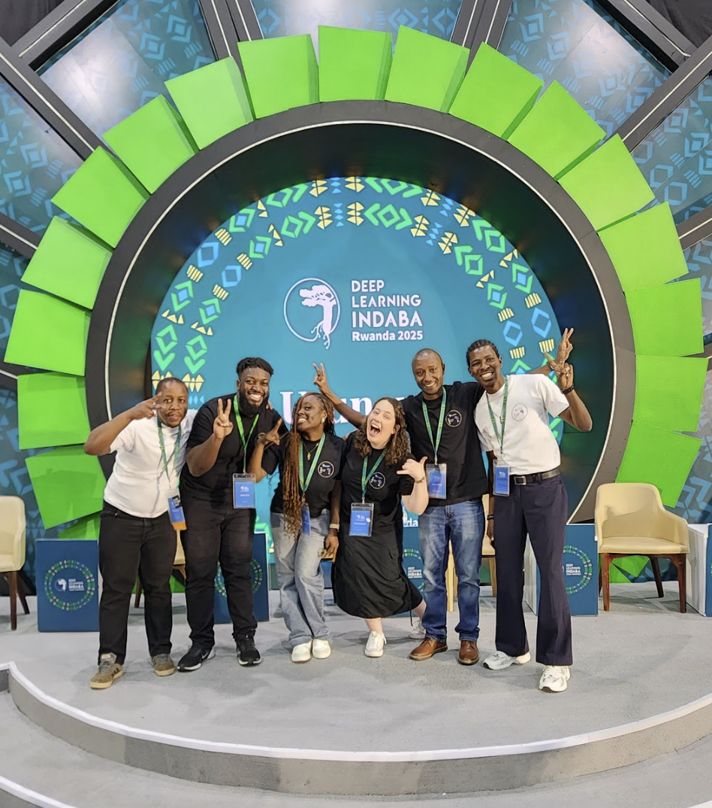

# Overview

## Location
Kigali, Rwanda

The Data Science for Health in Africa (DS4Health) workshop took place on 21 August 2025 at the Deep Learning Indaba in Kigali, Rwanda. The event marked the fourth edition of the workshop and its largest turnout to date, bringing together over 100 researchers, healthcare professionals, and technologists from across Africa. Building on lessons from 2024, the workshop used insights from feedback reports to refine its structure, improve outreach, and strengthen engagement — resulting in a dynamic, high-impact event. 

The day began with a keynote by [Professor Michael Best](https://mikeb.inta.gatech.edu/) (Georgia Institute of Technology), who spoke on designing technology with the recipient community in mind. This was followed by a panel discussion on The State of AI for Healthcare Research in Africa. As moderator, I designed the question set, guided the discussion, and ensured that perspectives from academia, industry, and clinical care were interwoven to highlight both progress and challenges in African health AI research.

Panelists included(from left):
[Prof. Michael Best](https://mikeb.inta.gatech.edu/) (Georgia Institute of Technology)
[Dr. Rose Nakasi](https://cocis.mak.ac.ug/faculty/information-technology/rose-nakasi/) (Makerere University AI Health Lab)
[Dr. Arijit Patra](https://www.linkedin.com/in/arijit-patra-92a18457/) (UCB Biopharma UK / University of Glasgow)
[Dr. Tobi Olatunji](http://intron.io/) (Intron Health Founder) and
[Jay Patel](https://jacarandahealth.org/) (Jacaranda Health Chief Technical Officer) 

The workshop was intentionally participatory, emphasising collaboration and peer learning.
The Lightning Talk Competition showcased the work of emerging African researchers. As Programming Chair, I coordinated submissions and selected the winning presentations based on scientific merit and clarity. 

Pictured here are the winners. The top scorer was Christopher Mvelase, followed by [Sourour Ammar](https://www.linkedin.com/in/sourour-ammar-15a82617/) and [Ferdaous Idlahcen](https://www.linkedin.com/in/ferdaous-idlahcen/).

The MedGemma tutorial, led by [Dr. Mercy Asiedu](https://www.linkedin.com/in/mercy-n-asiedu/) and [Dr. Sekou Remy](https://www.linkedin.com/in/sekoulremy/) from Google, provided hands-on experience in AI for medical imaging. The Design Dash followed, challenging interdisciplinary teams to design AI solutions addressing real healthcare challenges.

The day concluded with the launch of the Google-Sponsored DS4Health Ideathon. The Ideathon occured over 3 stages, with a final live pitch on the 9th of October 2025. I assisted with the Ideathon logistics and hosted the [final live pitching event](https://cassyni.com/series/JWAjLmN99Z4fd8mCJR9w6i). 

The 2025 workshop represented a significant leap in scale, visibility, and impact, much of which stemmed from using data and feedback gathered during the 2024 workshop to improve planning and delivery.

Key highlights included:
1. 3.8× increase in attendance and 4.5× rise in feedback responses compared to 2024.
2. A clearer, more structured agenda, refined using insights from participant feedback forms.
3. Targeted advertising and pre-workshop seminars, which expanded awareness and attracted high-quality applications.
4. Improved activity flow, balancing expert talks with participatory sessions.
5. Consistently high satisfaction ratings, with 100% of respondents describing the workshop as “very useful.”
6. Strong praise for the Design Dash and panel discussion, which participants ranked as the most engaging and impactful sessions.

These outcomes validated the refinements made from the previous year. This demonstrates how structured evaluation and adaptive design can enhance workshop outcomes and build lasting research communities.

From left in picture above: 
[Ditiro Rampate](https://www.linkedin.com/in/ditiro-rampate-46a999a4/), [Charles Nimo](https://www.linkedin.com/in/charlesnimo/), [Comfort Adesina](https://www.linkedin.com/in/comfort-adesina-77808b233/), myself, [Ashery Mbilinyi](https://www.linkedin.com/in/asherymbilinyi/) and [Marvellous Ajala ](https://www.linkedin.com/in/marvellousajala/)

# Roles and Responsibilities
I led both the conceptual and operational planning of the workshop and Ideathon.
Key responsibilities included:
1. Organizing and moderating the AI in Health Research panel.
2. Selecting Lightning Talk winners and facilitating their presentations.
3. Designing the overall workshop structure and program flow, inclusive of co-authoring the proposal for the Deep Learning Indaba.
4. I managed on-ground logistics, and handled the liasing with main conference organisers.
5. Overseeing marketing, logistics, and budget management.
6. Coordinating pre-workshop [seminars](https://cassyni.com/series/SHSF3nqRsEe2LA6h5s6PmC) to build awareness and momentum.
7. Hosting and supporting the [Ideathon](https://cassyni.com/series/JWAjLmN99Z4fd8mCJR9w6i).
8. Consolidating feedback and writing post-event outcome reports and blog features. 

### Skills: 
Leadership, Technical Program Design, Event Planning, Panel Moderation, Workshop Facilitation, Budget Management, Marketing Strategy, Team Coordination, Research Communication , AI for Health Capacity Building

