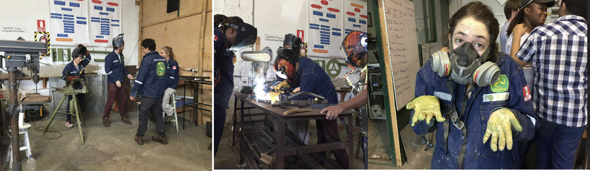
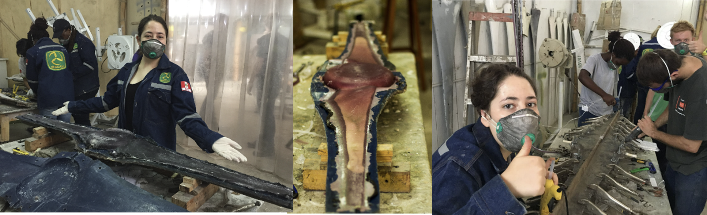
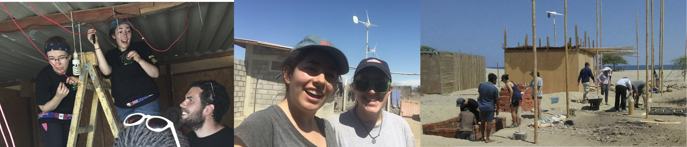
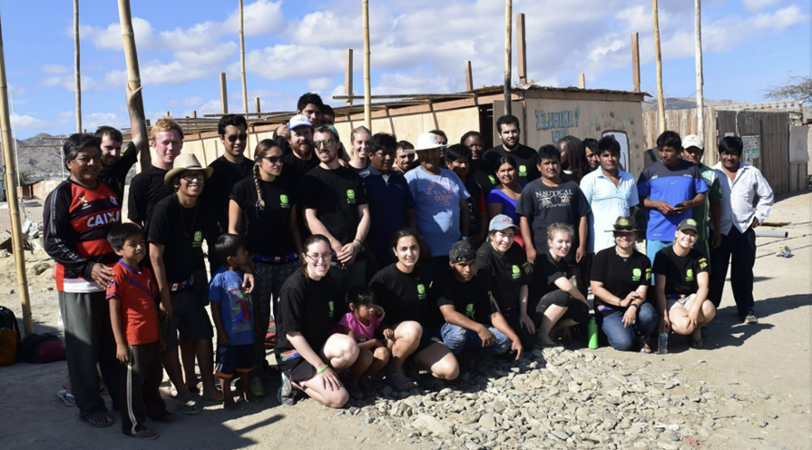

# Overview:

[WindAid](https://windaid.org/) is a non-profit organisation operating out of Trujillo, Peru with the aim of providing wind energy solutions to communities inaccessible to standard grid electricity, especially in underserved rural communities. WinAid attracts international students and professionals to assist on their programs which aim to have a new wind turbine built and installed over the month program. 

Over my time at WindAid, I was involved on all facets of the wind turbine production. This included the welding of the base support structure and its subsequent water proofing spraying.

I was also responsible for assisting with producing the coils needed for the electromagnetic induction behind the electricity generation. Additionally, I was involved with assisting in the production of an anemometer system to monitor wind speeds for the purpose of monitoring previously installed wind turbines. 

The actual construction of the wind turbine blades was a multiday event. It starts with lining the mold with fiber glass, then securing the two mould halves together and filling the mold with a foam mixture. The foam core is then removed and covered in fiberglass and carbon fiber and then a resin mixture is injected via a vacuum pump to saturate the mold fibers. 

During my time at WindAid, the recipient community was a remote fishing village within Playa Blanca. The installation process included the wind turbine mounting, connecting the internal electrical wiring and testing all connections. 

### Skills: 
Anenometer, Arduino, Electrical Installation, Renewable Energy, Wind Turbine Creation